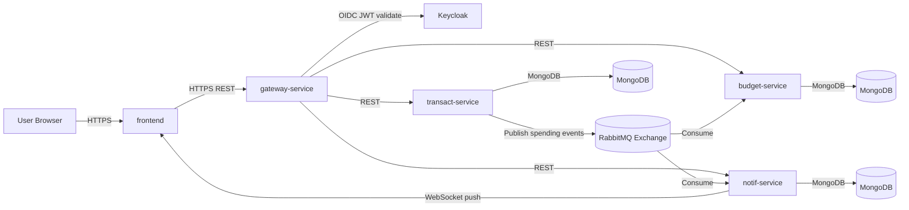
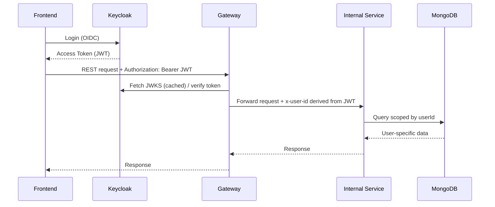
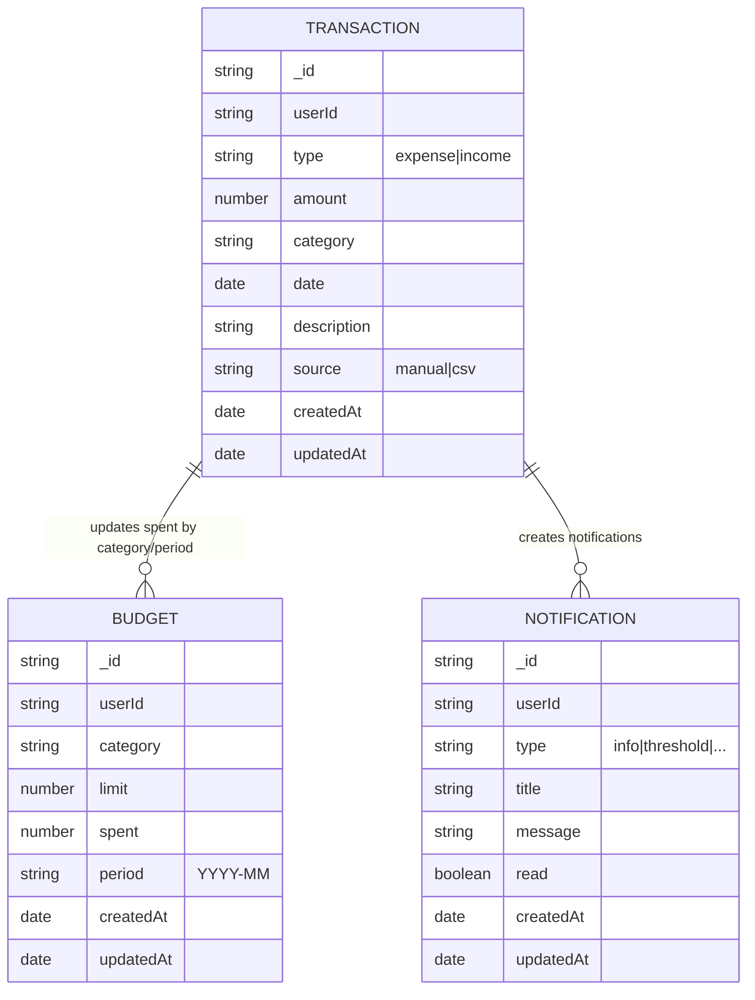

# Mintify -- Report

## 1) Motivation: what makes the system a dynamic web system
Mintify supports:
- **User-specific data** for budgets, transactions and notifications that changes continuously
- **Real-time updates** as notifications are pushed to clients via WebSockets when new spending events occur
- **Event-driven processing** where creating a transaction triggers asynchronous workflows through RabbitMQ
- **External API integration** that creates dynamic finanical advice based on user transaction history
- **Secure request flow** as end users authenticate via Keycloak

## 2) High-level Architecture

### 2.1 Services overview
- **frontend**         : UI (React + Vite SPA) served via Nginx
- **gateway-service**  : single entry point that validates tokens and routes to internal services
- **Keycloak**         : authentication, identity provider
- **budget-service**   : CRUD budgets; consumes spending events to update spent
- **transact-service** : CRUD transactions + CSV import; publishes spending events; generates AI advice
- **notif-service**    : stores notifications; consumes events; pushes WebSocket notifications
- **rabbitmq**         : event broker (exchange/queues)
- **mongodb**          : persistent storage for service data (MongoDB Atlas)

### 2.2 System diagram


### 2.3 Communication patterns
- **Synchronous (REST)**    : frontend --> gateway-service --> internal services
- **Asynchronous (events)** : transact-service --> RabbitMQ --> budget-service/notif-service
- **Real-time**             : notif-service --> frontend via WebSocket
- **Persistence**           : each service stores user-scoped documents in MongoDB (Atlas)

### 2.4 Production deployment overview (cloud-native)
- The system runs on an LTU-managed K3s Kubernetes cluster behind Traefik ingress.
- cert-manager issues and renews TLS certificates using the letsencrypt-prod ClusterIssuer.
- Workloads are separated across namespaces:
  - **mintify**: application services (frontend + gateway + internal services)
  - **monitoring**: Prometheus + Grafana
  - **argocd**: ArgoCD GitOps controller
  - **kube-system**: kube-state-metrics + core components
- Services are deployed using Helm charts, and ArgoCD Applications continuously reconcile cluster state from Git.
> **Note (TLS/certificates):** Early issues occurred when a certificate issued for one hostname did not include other required hostnames. This was resolved by consolidating Helm-managed ingress TLS hosts (single multi-host certificate), removing manual ingress edits that conflicted with Helm ownership, and allowing cert-manager to re-issue a correct certificate.

## 3) GitOps CI/CD Pipeline

### 3.1 CI vs CD responsibilities (design intent)
Mintify intentionally separates deterministic CI tests from infrastructure-dependent smoke tests:
- **Backend CI (GitHub Actions):**
  - Runs `npm ci` + `npm test` per service.
  - Uses a matrix over services and path filters so only affected services run.
  - Designed to be repeatable and infrastructure-free (no live cluster or Keycloak required).
- **CD (GitHub Actions + GitOps):**
  - Detects changed services, builds `linux/amd64` images, pushes to registry.
  - Updates Helm `values.yaml` image tags in the repo.
  - Commits those changes back to Git with a skip marker to avoid recursive workflow triggers.
  - ArgoCD detects the updated tags in Git and deploys them automatically to the cluster.

### 3.2 CI workflow (backend-ci.yml)
- **Trigger:**
  - `push` and `pull_request` to `main` and `junteak`
  - Limited to backend service paths

- **Matrix strategy executes per service directory:**
  - `budget-service`
  - `transact-service`
  - `notif-service`
  - `gateway-service`

- **Steps (per service):**
  - `checkout`
  - Set up Node.js 20 with npm caching
  - `npm ci`
  - `npm test` with:
    - `CI=true`
    - `NODE_ENV=test`

### 3.3 CD workflow (services-cd.yml)
- **Trigger:**
  - `push` to `junteak`
  - Limited to `services/**`, `frontend/**`, `deploy/**`

- **Change detection:**
  - Uses `dorny/paths-filter` to detect which components changed.

- **Build & publish:**
  - Builds and pushes only changed images using `docker/build-push-action`.
  - Always targets `linux/amd64` to avoid architecture mismatch:
    - developer machine is Windows ARM
    - cluster is amd64

- **Tagging strategy:**
  - Computes a short SHA tag like `amd64-<shortsha>`.

- **Helm updates:**
  - Uses `yq` to update each corresponding Helm  
    `deploy/<service>/values.yaml` with the new tag.

- **GitOps commit:**
  - Commits and pushes the updated values back to `junteak` with message:
    - `chore: bump images for changed services to <tag> [skip cd]`

### 3.4 GitOps deployment (ArgoCD)
- Each service is represented as an ArgoCD Application pointing to its Helm chart in the repository.
- ArgoCD continuously:
  - syncs desired state from Git,
  - deploys updates automatically after CI/CD commits,
  - self-heals drift,
  - prunes obsolete resources.

### 3.5 Pipeline diagram
```mermaid
flowchart LR
  DEV[Developer Push/PR] --> GH[GitHub Repo]

  GH --> CI[Backend CI: npm ci + npm test<br/>(matrix per service)]
  CI -->|pass| CDW[services-cd: build/push amd64 images<br/>update Helm values.yaml]

  CDW --> REG[Docker Hub / Registry]
  CDW --> GIT[Commit updated values.yaml<br/>with [skip cd]]

  GIT --> ARGO[ArgoCD watches Git]
  ARGO --> K8S[K3s Cluster (mintify namespace)]
  K8S --> OBS[Prometheus + Grafana dashboards]
```

## 4) Security Model

### 4.1 Security design
- Authentication: Keycloak OIDC
- Gateway validates JWT signature using JWKS and checks issuer
- Gateway derives user id from token claims and propagates identity downstream (x-user-id header)
- Services enforce multi-tenancy by scoping DB queries to userId

### 4.2 Request flow diagram


### 4.3 Keycloak token verification middleware (Node.js)
The backend uses a JWKS-based verifier to validate Keycloak-issued JWTs. In production
mode, requests must present a valid token. In development mode, a fallback user can be
enabled to speed up local testing.

**Key behavior:**

- If `Authorization: Bearer <token>` is present and JWKS is configured:
  - verify JWT signature via JWKS (RS256)
  - optionally check `issuer` and `audience` if configured
  - extract user identity from token claims (e.g. `sub`, `preferred_username`, `email`)
  - attach `req.user` for downstream authorization & DB scoping

- If `ALLOW_DEV_USER=true`, accept `x-user-id`  
  (or default to `demo-user`) for local development only

- Otherwise reject with `401 Authentication required`

### 4.4 Notes
- In dev mode, gateway/services can allow fallback identity to speed up development
- In production, fallback should be disabled
- Observability endpoints such as `/health` and `/metrics` are configured to bypass user authentication where appropriate (so Prometheus can scrape without end-user tokens)

## 5) Monitoring Set-up

### 5.1 Monitoring stack (Prometheus + Grafana)
Mintify includes a working monitoring stack deployed to the cluster:
- **Prometheus** scrapes service and cluster metrics.
- **Grafana** visualizes metrics in a structured dashboard (e.g., *“Mintify – System Overview”*).
- Services expose a `/metrics` endpoint instrumented with `prom-client`.

### 5.2 Application metrics (service-level)
Each backend service exports standard Node/process + HTTP metrics (typical examples):
- Process CPU and memory metrics
- Node.js event loop / runtime health metrics
- HTTP request count, duration, and status code breakdown
- Selected domain-specific metrics where relevant

Prometheus scraping is enabled via Kubernetes Service annotations and discovery
configuration, and validated through the Prometheus *Targets* UI as well as direct
`kubectl port-forward` + `curl` checks.

### 5.3 Cluster metrics (kube-state-metrics)
To observe Kubernetes state (pods, restarts, phases, namespace inventory),
**kube-state-metrics** is deployed in the `kube-system` namespace and scraped by
Prometheus. This enables cluster health panels such as:
- Running pod counts in the `mintify` namespace
- Pod restarts over time
- Pod inventory by namespace
- Pod phase distribution (Running, Pending, CrashLoopBackOff, etc.)

### 5.4 Dashboard structure (Grafana)
Grafana dashboards are organized by meaning (not a random panel list):
- **API health**: request rate, p95 latency, 4xx vs 5xx breakdown
- **Kubernetes health**: pod inventory, restarts, namespace-level counts
- **Observability health**: Prometheus target counts and scrape success

> *Note:* Node-level host metrics are excluded if node-exporter is not installed,
> to avoid overstating observability coverage.

### 5.5 Operational note (port-forward UX)
Prometheus can appear slow to load when accessed locally via
`kubectl port-forward` (especially on Windows). This is treated as a local
networking or port-forward constraint rather than a cluster scraping issue,
and does not affect Grafana dashboards or in-cluster monitoring.

## 6) Database Schemas

