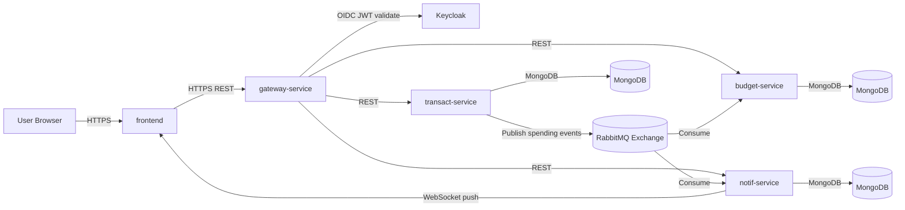
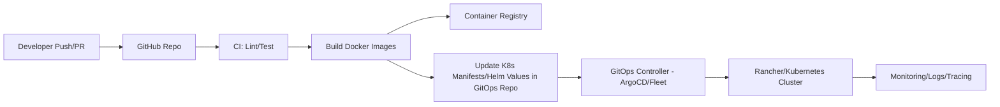
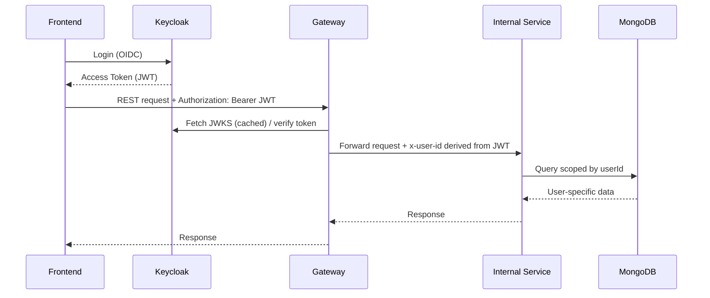
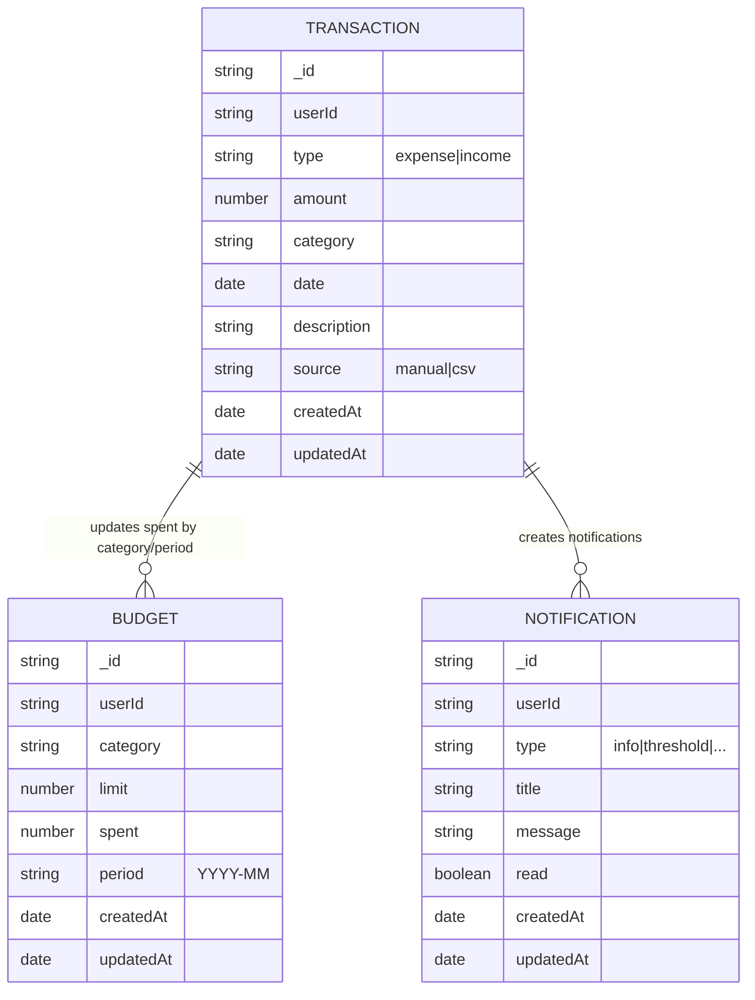

# Mintify -- Report

## 1) Motivation: what makes the system a dynamic web system
Mintify supports:
- **User-specific data** for budgets, transactions and notifications that changes continuously
- **Real-time updates** as notifications are pushed to clients via WebSockets when new spending events occur
- **Event-driven processing** where creating a transaction triggers asynchronous workflows through RabbitMQ
- **External API integration** that creates dynamic finanical advice based on user transaction history
- **Secure request flow** as end users authenticate via Keycloak

## 2) High-level Architecture

### 2.1 Services overview
- **frontend**         : UI
- **gateway-service**  : single entry point that validates tokens and routes to internal services
- **Keycloak**         : authentication, identity provider
- **budget-service**   : CRUD budgets; consumes spending events to update spent
- **transact-service** : CRUD transactions + CSV import; publishes spending events
- **notif-service**    : stores notifications; consumes events; pushes WebSocket notifications
- **rabbitmq**         : event broker
- **mongodb**          : persistent storage for service data

### 2.2 System diagram

### 2.3 Communication patterns
- **Synchronous (REST)**    : frontend --> gateway-service --> internal services
- **Asynchronous (events)** : transact-service --> RabbitMQ --> budget-service/notif-service
- **Real-time**             : notif-service --> frontend via WebSocket

## 3) GitOps CI/CD Pipeline

## 4) Security Model

### 4.1 Security design
- Authentication: Keycloak OIDC
- Gateway validates JWT signature using JWKS and checks issuer
- Gateway derives user id from token claims and propagates identity downstream (x-user-id header)
- Services enforce multi-tenancy by scoping DB queries to userId

### 4.2 Request flow diagram

### 4.3 Notes
- In dev mode, gateway can allow fallback identity to speed up development
- In production, fallback should be disabled

## 5) Monitoring Set-up

## 6) Database Schemas

